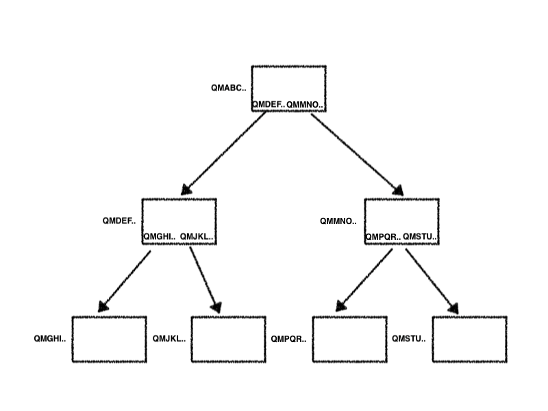
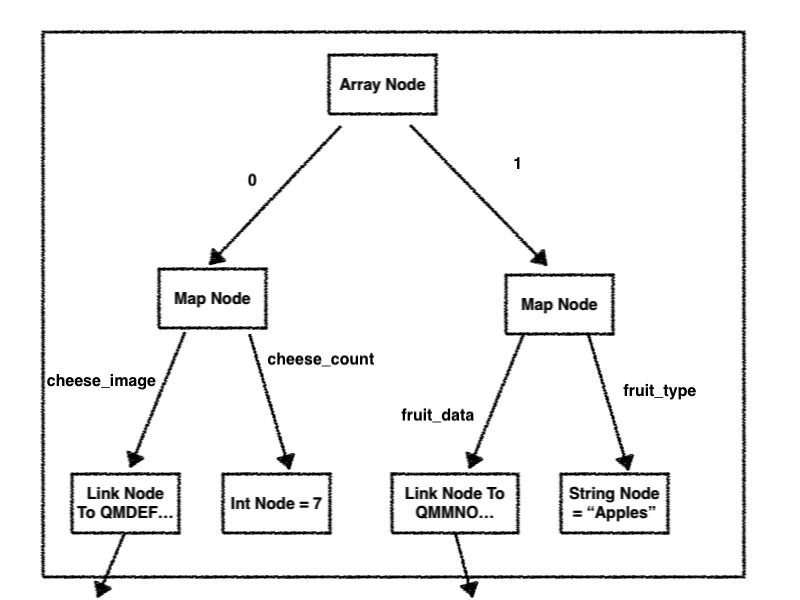
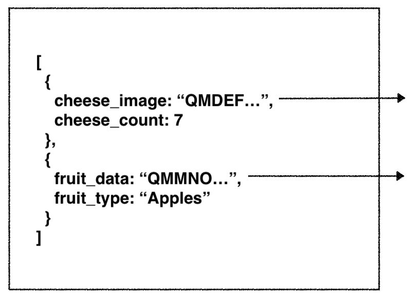
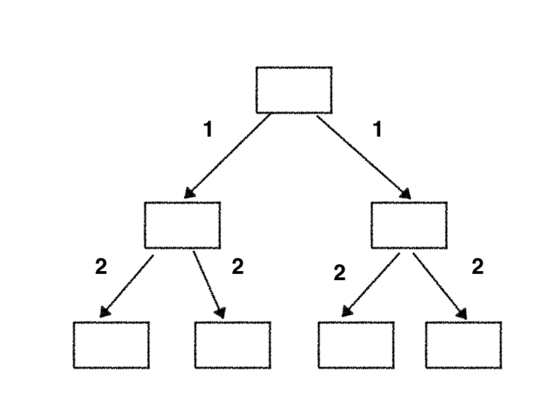
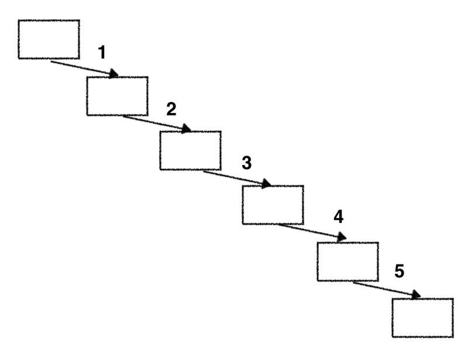

# Replication protocol

How can we more quickly sync a DAG or part of a DAG between two nodes? Our current protocol is Bitswap, which operates at the block level. That means to traverse a DAG, we have to make several round trips because we need the contents of the block to explore it's links.

In this session, we'll explore potential alternatives to Bitswap, and the potential advantages, pitfalls, and challenges of each. We'll also review the current state of the art in replication in IPFS -- namely a protocol called GraphSync

## Audience

- Should have a basic understanding of MerkleDAGs, IPFS/IPLD terminology
- Interested in thinking through and understand problems in next generation IPFS data transfer

## Goal

- Understand the core data structures of IPLD, MerkleDAGs, etc, and the challenges in syncing them across networks
- Design a mock replication protocol together!
- Review the landscape of technologies and approaches for syncing graphs

## Requirements to consider

- How to we express what parts of a graph we want to sync?
- What do we do when a node has only a partial part of the graph we requested?
- How do we verify results from a remote peer in response to a query?
- How can we spread fetching a replication across multiple peers?

## Resources

[IPLD Data Model](https://github.com/ipld/specs/blob/master/data-model-layer/data-model.md)
[IPLD Selector Spec](https://github.com/ipld/specs/blob/master/block-layer/selectors/selectors.md)
[GraphSync Spec](https://github.com/ipld/specs/blob/master/block-layer/graphsync/graphsync.md)

## Team

* [@hannahhoward](https://github.com/hannahhoward)
* [@jacobheun](https://github.com/jacobheun)
* [@teh-f00l](https://github.com/teh-f00l)

## Presentation

🎤 [Slides](https://docs.google.com/presentation/d/105KwT6ZmcneywGnvUyww5y-u_GHSY0FFQ0yIXZQf7Y0/edit#slide=id.g5c6a5171f6_0_188)

## Notes

### Laying out the Problem

#### What is a MerkleDAG?

MerkleDAG is just a bunch of hashed blocks which each contain the hashes of other blocks somewhere in their content.

The only requirement is that there are no cycles in the connection (can't be done w/o changing hashes), and the links only go one direction. (Directed and acyclic)

The shape of the DAG is unknown -- could be wide and flat, or long and narrow, and multiple blocks could linke to the same block.

#### IPLD

What's inside of each of these blocks? Well technically anything, but for our purposes, let's assume it's an IPLD data structure. 

IPLD is just distributed data -- abstractly, its very similar to JSON, but with one addon -- it can have a link type - a CID that links to another block of IPLD data. Here's an abstract representation of an IPLD node:

And here's what the same structure would look like if we imagine it as JSON:

#### The Task

Our task is to replicate a MerkleDAG - on my peer, I have only a root hash of the first block I want, and I want to get some or all of the the entire graph of blocks under it.

#### In a non-distributed world

We can imagine some easy ways to solve this in an non-distributed world. Let's say I am a web browser, downloading a DAG from a trusted server with HTTP. The things I need to take into account are:
1. I should minimize roundtrips to the server (latency) and optimize download speed.
2. As a server I might not trust the clients. (so I have to account for DDOS)
3. As a server I might have to serve multiple clients with multiple clients at once. 

However, at the same time:
1. As a client, I could request entire portions of a graph and trust what I get back.
2. As a client, I would not need to receive requests.
3. As a client, I can trust that if the graph exists, the server and only the trusted server has all of it. (even if the data is sharded somewhere in the server infrastructure)

#### Characteristics of IPFS for DAG replication

Replicating DAGs in a global untrusted peer to peer system is different and much harder, though potentially faster.

These are the core characteristics of the IPFS environment:
1. Responding Peers Are Not Trusted (assuming you are not running a private network)
2. Multiple Peers May Have The Same DAG
3. Peers May Have Part But Not All Of DAG requested
4. Just like the web, requestors not trusted
5. Any peer is BOTH a requestor and a responder
6. Who even has the root of the DAG not known ahead of time
7. Like the web, responders may have to serve multiple requests

This presents MANY additional challenges and makes our problem significantly harder.

### Existing Solutions

How can we reliably replicate anything in an untrusted environment?

Our main tool for reliability is content addressability. If we start with a root hash, and request that block, we can take the returned data, rehash it, and thus verify it. Once we trust that block, we know the trusted hashes of the blocks it links to. We can now request those blocks, verify them, and repeat the process till we get the whole DAG. This is essentially the strategy of Bitswap -- which requests and verifies individual blocks. Higher level code then walks the DAG block by block, to replicate a whole graph.

#### Downsides Of Bitswap

A block level replication strategy presents gives us a way to replicate graphs, but presents several downsides, some of which can be improved upon, and some of which can't:
1. Most significantly, we must make many roundtrips in order to walk the DAG. You can see all the roundtrips we make in the illustration of walking a sample DAG by block. 
2. Finding content - since Bitswap only knows about blocks, we have to treat the content discovery on a block level. This means every block has to be requested from every peer -- and then we have to go to the DHT if no peers have the block.
3. Duplication - if we ask everyone for the block, and everyone has it, they might all send the same block.

#### Bitswap Optimizations

There are several ways we can mitigate but all of these problems in Bitswap, which will also help us understand the some advantages of a block level strategy.

1. Parallelism -- the first and perhaps most trivial operation is to parallelize our DAG walk. 

In the illustration above, even though we make the same number of round trips, we can see that we can massively reduce the amount of total latency by making them in parallel. Go and even JS provide fairly simple concurrency primitives to facilitate this.

2. Sessions -- while Bitswap knows nothing about the connections between blocks, the code that walks a DAG does. We can provide a mechanism to tell Bitswap to initiate a "session" of related block requests -- essentially saying, all the block requests I'm going to make are related, you should optimize accordingly. For example, we can massively mitigate our content discovery problem by assuming that any peer who sends us one block in a DAG is exponentially more likely to have other parts of a DAG than a random peer we are connected to. Morever, once we know requests are related, we can track peer responses across requests. Quickly we can establish the best peers and split requests for blocks among them, achieving a near Bittorrent like transfer optimization and potentially going faster than raw HTTP. (there are still several challenges in actually achieving BitTorrent like speeds)

#### Bitswap Limitations

There are some hard limits to optimization with a pure bitswap strategy with certain types of graphs. While many of these optimizations work well with Graphs that are wide and relatively flat, consider a block chain:

There is no way to parallelize this DAG walk, at all. The total latency is exactly the latency per block times the number of blocks in the chain.

### Future Evolutions

#### Graphsync

What if we could potentially ask for more than a block at a time? 

Let's assume we have a way to query a graph/tree (this is essentially what IPLD selectors will do). We could send these queries to remote peers, have them execute the query, and send us the results back. Although it is harder to verify responses, we can still do so by executing the query again locally from the root hash and the blocks returned by the responding peer. 

In fact, this type of approach, coming to IPFS in the form of GraphSync is ideal for exactly the type of graph that Bitswap breaks down for -- a deep and narrow graph. We can minimize latency while not fundamentally affecting transfer speed since the transfer can't be parallelized to begin with.

However, Graphsync has it's own downsides:

- It's harder to parallelize. How do we split queries across peers? Splitting queries is much harder than splitting block requests. It's also not as simple as getting the root block and then spliting the requests for sub-DAGs of children. A DAG being acyclic does not mean you won't cross the same block twice. Sub DAGs can overlap. This means we might need an additional addon to Graphsync to handle a partial cancellation of a request once we know we're walking it twice!
- DDOSing is potentially really easy with Graphsync! A request for an individual block is much smaller than a request for either all or part of a DAG in terms of CPU usage, memory, and network bandwidth. A single malicious graphsync query could potentially take down a peer! Without additional checks, Graphsync is easy to DDOS.

#### Manifest Blocks

Many of our challenges with making DAG replication fast are rooted in knowing nothing about the graph we're fetching beyond the root hash ahead of time. What if that weren't true? Interestingly, QRA's community tool `dsync` adopts exactly this approach in the form of manifest blocks. Manifest blocks can take a variety of forms, but essentially, they would be linked form a root block and provide important information about the subdag that sits below it. That information could be CIDs of blocks that will be encountered in a traverse, or perhaps the shape of all or parts of the graph (including depth, split factor). This might help us speed up a parallel bitswap transfer on a narrow and deep tree for example. Or even help us identify where to utilize Graphsync vs Bitswap.

Note: we still have to traverse DAGs locally before we can actually trust the manifest's information.

### Proposal For a Future Meta-Protocol

While Graphsync itself is still early in development, a mature Bitswap and a mature Graphsync could be augmented some form of manifest blocks to provide a truly robust general purpose IPLD replication meta-protocol. We could use manafest blocks to optimize bitswap and make smart decisions in combining bitswap and Graphsync to maximize transfer and replication speed.
