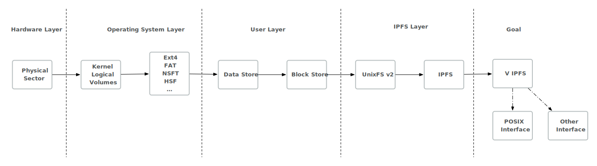
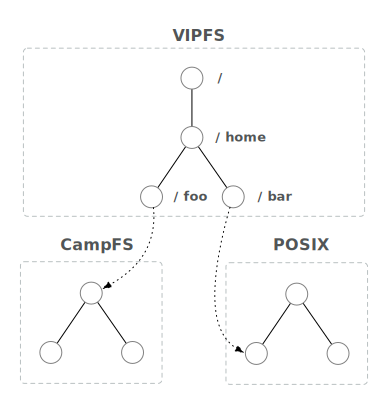

# Mounting an IPFS filesystem

Given that IPFS is a filesystem, we need to have ways to map it as a filesystem on various existing systems, such as an operating system or programming language interface.

In this session we'll be diving into a variety of related concerns, such as (but not limited to ;^)
 - What do we have today?
   - Explore other filesystems/APIs (e.g. Unix, Plan9/9P, SPRING, FUSE, et al.)
   - Explore IPFS formats
 - What design requirements and implentation challenges do we have for tomorrow?
   - What features do we want to consider "standard" (IPFS, IPNS, FilesAPI, etc.)
   - System/API target support and limitations; (kernel interfaces (\*nix, Win32/NT), network protocols (WebDAV), language runtimes (Go, JS), etc.)
 - Efficiency patterns and data structures / caching

## Goal

Our goal is to explore the current state of mounting IPFS, problems with it, and see what we can do to improve the next iterations.

Long term we seek to acheive the ability to mount IPFS as a filesystem for use with existing systems and applications as well as a flexible way to craft new systems on top of.
When given a flexible filesystem API, developers are enabled to create a broad range of things at many levels.

The operating system Plan9, takes heavy advantage of the [union mount](https://en.wikipedia.org/wiki/Union_mount) concept to construct trees of trees that transparently handle network traversal among other things.

WebDAV is often used in network storage drives, and mainstream operating systems come with native support for mounting WebDAV as drives. It could supersede Writable Gateway and create a surface for interop with apps that provide built-in client-side support for WebDAV. https://github.com/ipfs/in-web-browsers/issues/146

## Requirements to consider

- We're bound to the API's we target and depend on
- Portability is important
- We must be careful to remain scoped when discussing different but interconnected layers

## Where to learn about it
https://github.com/ipfs/go-ipfs/blob/v0.4.21/docs/fuse.md
https://github.com/ipfs/go-ipfs/issues/5003
https://github.com/ipfs/interface-go-ipfs-core/pull/30
https://github.com/tableflip/ipfs-fuse

## Team

* [@djdv](https://github.com/djdv)
* [@hinshun](https://github.com/hinshun)
* [@vojtechsimetka](https://github.com/vojtechsimetka)
* [@ianamunoz](https://github.com/ianamunoz)

## Presentation

🎤 [Slides](https://docs.google.com/presentation/d/105KwT6ZmcneywGnvUyww5y-u_GHSY0FFQ0yIXZQf7Y0/edit#slide=id.g5c6a5171f6_0_243)

## Notes

> Our problem scope is to define an API to modify named objects from IPFS

### Summary

UnixfsV2 is about defining an abstract VFS that is decoupled from all the nuances from filesystems. When we mount UnixfsV2 on a unix filesystem, we will need to implement a POSIX bridge to fulfill its specificities.

### Context

Unix - the starting point (everything is a file)
- opening a object by name, using fd to do system calls
- a way of maniplating named references
- dependent on platform
- didn't get standardized until unix v4 (~1980)
- POSIX - standardization of a portable system interface (~1990)
- documented side effectes on the system
- exceptions: named pipes and devices (backed in-memory by the kernel)

[Plan9](https://www.orosk.com/plan-9-filesystem-protocol/) - generalize it further (everything is a filesystem)
  - contract between a filesystem and an API
  - no longer calling open() to the kernel, now calling open() on an object in some namespace
  - composable by other anything (like other filesystems)
  - *they don't have a path variable* they rely on a single bin directory (point: compose this directory)
  - unionfs - composing filesystems (append to the front, to back, or replace outright)
  - if i want is `ls` (e.g. bind your /bin/ls to my bin), doesn't matter if its local or networked
  - named objects are versioned (allows generic cache coherency, without understanding what the name references)

IPFS wants to expose a filesystem like Plan9, expose objects as files or filesystems

[Spring](https://en.wikipedia.org/wiki/Spring_(operating_system)#File_system) - from sun microsystem (unsure if public?)
  - things are named
  - relation between names and objects
  - filesystems/files have a finite set of types (files, directories, symlinks), whereas spring wants to decouple it completely
  - research eventually led into java development

[ZFS](http://open-zfs.org/wiki/Main_Page)
  - already uses merkle DAG as a storage
  - has NFS mount
  - concept of pooling resources (abstracts volume management away)
  - from pool resources you can derive filesystems (have their own rulesets, versions, features)
  - exposes other protocols as non-native, its very pluggable
  - translation layers from on-the-wire protocols to native syscalls, etc.
  - self contained
  - more than just a filesystem
  - BTRFS also related

### Current work

https://github.com/djdv/interface-go-ipfs-core/tree/feat/filesystem/filesystem

- Work in progress [interfaces](https://github.com/djdv/interface-go-ipfs-core/blob/feat/filesystem/filesystem/interface/interface.go) and components of what a "filesystem" is

default
  - example of a filesystem implementation

interface
  - directories
    - doesn't have to be directories, just a key value map
  - symlinks
    - not constructs for users, but for the filesystem
  - filesystem
    - create named objects of various types
    - remove named objects
    - `OpenFile`, `OpenDirectory`, `OpenReference` syntatic sugar for developers
    - expose a lookup a named reference to get a object, then you can typecheck it
    - everything is a reference for a filesystem to use
    - needs backwards compatibility with POSIX

### Plan

> We wish to create a virtual file system interface that works with abstract linked nodes, which developers can build and compose opinionated filesystems.

### Definitions

`junction`
  - symlink to a directory but has to be an absolute path

`atime`
  - access time, whenever an operation is made on any named node, it has to modify to atime
  - even reads are writes (updating atime)
  - IPFS needs to implement it nevertheless because there are programs that depend on atime (if we want to be POSIX compliant)
  - we should decouple file metadata from the file data
  - unixv1 - has metadata as the first block of the chunke ddata
  - unixv2 - aim to have 2 seperate merkle dags for metadata and data

### Links & Resources:
- https://github.com/djdv/interface-go-ipfs-core/tree/feat/filesystem/filesystem
- http://pubs.opengroup.org/onlinepubs/009695399/functions/read.html
- https://www.youtube.com/playlist?list=PLrZxGPqQuwHC_cZF2assuM0Vl3D5s5OSN
