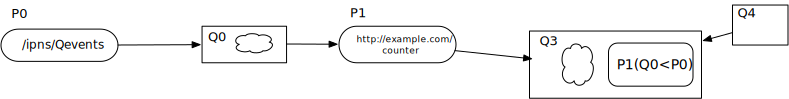
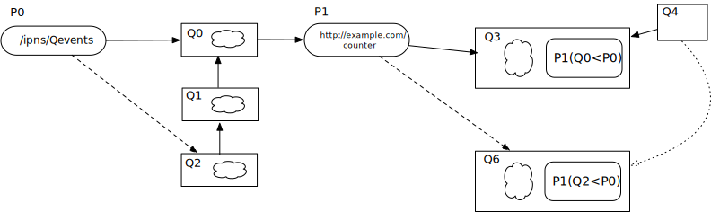

# DAG traversal of mutable resources

## Motivation

IPLD works on immutable DAG nodes. It may be possible to include refereces to external resources that are mutable, such as a collaborative document obtained through a URL. In fact, many "mutable" resources are the result of a computational process applied to data, which itself might be immutable, or composed of immutable elements, such as an event queue.

As such, instead of thinking of such a resource as mutable, we can think of it as a chain of immutable computation results that follows (a subset of) the chain of events. Each computation result could be made to contain a reference to its originating data (a point in an event chain) in such a way that the subsequent state may be retrieved (the head of the chain) and the result of the computation could be "updated", or more accurately replaced with the new value.

## Elements of solution

### Remote process pointers

It should be possible to describe a set of methods to apply a computation to data, so as to build a reference to an execution context. There would be as many types of process pointers as there are ways to execute a remote procedure call, but we will assume that the process

* Consumes one or more named arguments
    ** Mostly DAG CIDs, maybe also IPNS or other IDs, or simple literals
* Outputs its result as a DAG CID
* Is deterministic

Remote process pointer (RPID) is a union type whose subptypes would include, but are not limited to:

* IPNS dereference
* HTTP POST
* Some ad hoc libp2p protocol

In particular, it would be useful to identify a process running in a node through an identifier, and even nicer if we could establish trust this way; but the latter consideration is out of scope for this iteration.

(Processes whose main role is to associate a queue name to the head of queue are a distinguished special case of such processes, with no argument.)

### Provenance descriptors

A provenance descriptor is a DAG record consisting of two elements:

1. A Remote process pointer
2. A map of named arguments to the process pointer, each value of which is a Multipointer, CID or literal.

Such a descriptor should accompany a computation result, in a new "@provenance" tag. (Note: we could consider a variant usage of processes that would be used by non-IPFS technologies, where the computation results would have format constraints that do not allow the presence of the provenance tag. In that case, the provenance could be provided in a http link header)

### Multipointers

A multipointer (MPt) is a pointer consisting of a CID, and a list of provenance descriptors.

### Dynamic traversal strategy

When a DAG path traverses a multipointer, the multipointer can be interpreted statically or dynamically.

In the general (static) case, it is the enclosed CID that is followed, as if it were given in place of the multipointer. So the normal DAG traversal path strategy remains deterministic.

When a multipointer path element is named with a preceding `*` in the traversal path, the traversal strategy will attempt to dynamically execute the remote process given by each provenance descriptor in turn, until one succeeds. (This is basically a fallback sequence.)

In the most general case, the dynamic path element would be followed with the name of the arguments whose multipointer values should also be evaluated dynamically; but as a shortcut, another `*` at the end of the name would imply to evaluate all arguments dynamically.

## Example

Let us suppose a small event chain as follows:

```json
Q0: {
    { "a": 1, "b": 2 },
    "prev": null
}

Q1: {
    { "b": 3, "c": 1},
    "prev": "Q0"
}

Q2: {
    { "a": 2, "d": 1},
    "prev": "Q1"
}
```

There is an IPNS name `ipld/Qevents` that always points to the latest event in the queue.
There is a http-based counter process, hosted at "http://example.com/counter"
At t0, while `ipld/Qevents` points to Q0, this process receives the arguments `{"head": "ipld/Qevents"}`, produces the following DAG, and returns its CID Q3:

```json
{
    "data": {"a": 1, "b": 2},
    "@provenance": {
        "@proc": {
            "@type": "http",
            "address": "http://example.com/counter"
        },
        "args": {
            "head": {
                "@type": "multipointer",
                "cid": {"/":"Q0"}
                "provs" [
                    {
                        "@proc": {
                            "@type": "ipns",
                            "name": "/ipns/Qevents"
                        },
                        "args": {}
                    }
                ]
            }
        }
    }
}
```

Now, suppose that some other DAG node refers to that result:

```json
Q4 = {"ref": {"/": "Q3"}}
```

So a path rooted at Q4 could take the traditional form

```
<Q4>/ref/data/a
```

and would always traverse to Q3 normally.



But, if `/ipld/Qevents` now points to Q2, and we instead evaluate the following path: `<Q4>/ref/*data:head/a` (or equivalently `<Q4>/ref/*data*/a`)

then the traversal would use the provenance information in `Q3` to first evaluate the new value of `<Q3>/@prov/args/head` by resolving `/ipns/Qevents` (given at `<Q3>/@prov/args/head/provs/@proc/name`) to Q2; Then it would call `http://example.com/counter` given at `<Q3>/@prov/@proc/address` with a new head value (probably a multipointer to cid: Q2, but which still contains the whole head provenance formula), so we would obtain a new calculation result:


```json
{
    "data": {"a": 3, "b": 5, "c":1, "d": 1},
    "@provenance": {
        "@proc": {
            "@type": "http",
            "address": "http://example.com/counter"
        },
        "args": {
            "head": {
                "@type": "multipointer",
                "cid": {"/":"Q2"}
                "provs" [
                    {
                        "@proc": {
                            "@type": "ipns",
                            "name": "/ipns/Qevents"
                        },
                        "args": {}
                    }
                ]
            }
        }
    }
}
```

Note that a call to `<Q4>/ref/*data/a` would have recalculated the procedure's result, but would have given the original head multipointer based on Q0, probably yielding Q3 again; unless the procedure was changed. (Open question: could we use a variable name for the procedure?)

Also note: we could have the provenance structure in two locations, if the refering pointer is itself a multipointer. Eg:

```json
Q6 = {
    "ref": {
        "@type": "multipoiner",
        "cid": {"/": "Q3"},
        "provs": [
            {
                "@proc": {
                    "@type": "http",
                    "address": "http://example2.com/another_counter"
                },
                "args": {
                    "head": {
                        "@type": "multipointer",
                        "cid": {"/":"Q2"}
                        "provs" [
                            {
                                "@proc": {
                                    "@type": "ipns",
                                    "name": "/ipns/Qevents"
                                },
                                "args": {}
                            }
                        ]
                    }
                }
            }
        ]
    }
}
```



In this case, the refering pointer's procedure have precedence over the provenance information of the computed result. (Whether we would want to cascade to the latter in case of failure is an open question.)

Finally, we could imagine that the combination of the RPID and argument list could be associated to the result's CID in a DHT, so as to cache computation results.

Again, this assumes that the procedure is idempotent. Maybe we could admit non-idempotent procedures if they were marked as such, but that seems contrary to the functional spirit of IPLD.

