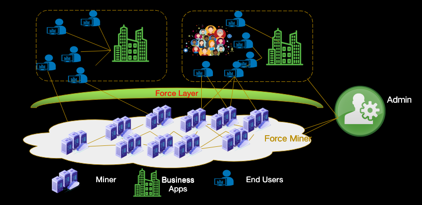
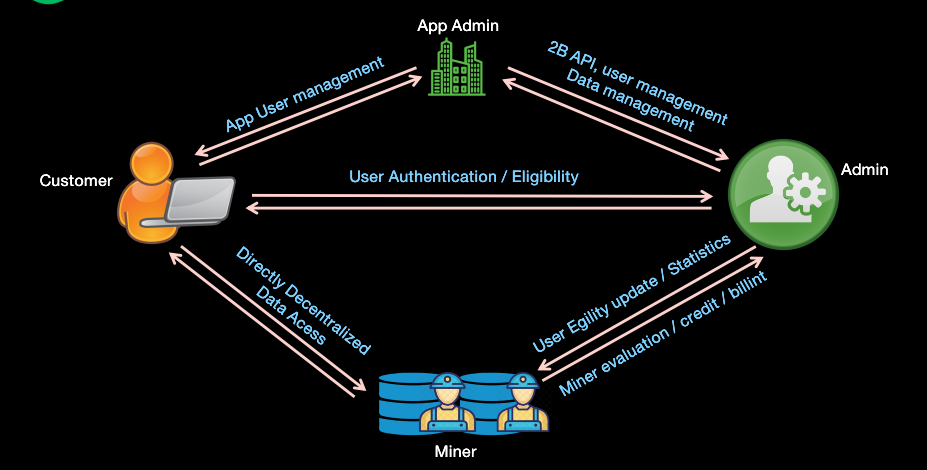

# ForcePlatform : A new layer to bridge IPFS and HTTP Apps and Users 

Hosted by : [@Steven004](https://github.com/steven004) 
Participants : [Molly Mackinlay](https://github.com/momack2);  [Colin Evran](mailto:colin@protocol.ai); 
               [Kinuko Yasuda](https://github.com/kinu); ......

## Challenges :

**How to link Users/Apps to IPFS?**  
long-term solution: all IPFS, request clients as IPFS nodes; Current solution: using a gateway. However, the gateway is bottleneck usually  

**Gateway is not only the bottleneck**  
Except of gateway, we still need to think about
- SLA
- User authentication
- Billing & Invoices
- Storage provider quality monitoring
- Content management
- Data deletion capacity 

for business users

With all these in mind, *A new service layer is required*. This layer could be build on IPFS.

**Force Platform - A service layer over IPFS** 

The objective of Force Platform is set up a new layer to support business use.

There are 4 types of players in the sharing storage eco-system.
- Administrator:  the admin for sharing storage market, just like Uber in taxi market, responsible for providing SLA, billing, monitoring, user authentication, miner evaluation, etc.
- Miners: Storage providers who make money via data saving and retrieving
- Business Application Owners: to develop application based on ForceFS, responsible for end user management, user quota, content compliance, etc. 
- End Users: Users to use business applications, who will access the ForceFS directly via Apps 

 

## How it works : 

## Notes of the meeting :

*Thanks Molly for taking notes*, which is pretty good, and the most interesting thing is that the Force platform is to be built as IPFs-Filecoin bridge next.

 

## Follow us :

If you want to join us to build up IPFS eco-system for commercial usage, or you could be a user or APP developer and want to buld your applications on IPFS for better decentralization, performance and throughput, please contact us. 

We will launch this product within this year. Please visit [forceup website](https://forceup.cn/pro/index.html) to get update. You can find our contact information from [this website](https://forceup.cn/pro/index.html) or [our community site](http://ipfser.org). 

See you,

IPFS-Force Commuinity  
http://ipfser.org